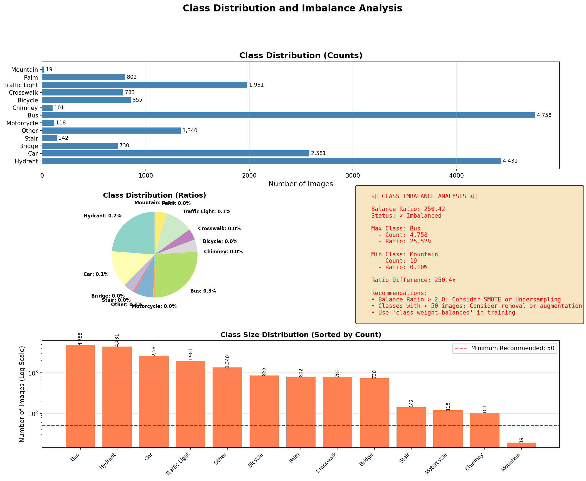

# 🚦 Google reCAPTCHA Image Classifer: From ML to Deep Learning

본 문서는 Google reCAPTCHA v2의 이미지 타일들을 분류하기 위해 수행한 **데이터 분석, 머신러닝 실험, 그리고 딥러닝 최적화**의 전체 과정을 기록한 심층 보고서입니다.  
수많은 시행착오와 수십 번의 실험 끝에 **정확도 98.75%**를 달성하기까지의 여정을 모든 시각화 자료와 함께 상세히 기술합니다.

---

## 📅 Part 1. 데이터 분석 및 전처리 (EDA & Preprocessing)

프로젝트의 시작은 데이터를 이해하고, 모델이 학습하기 좋은 형태로 가공하는 것이었습니다.

### 1-1. 데이터셋 기초 분석
데이터의 크기와 분포를 먼저 확인했습니다.

*(이미지 크기 분포)*

- **문제점**: 데이터셋의 이미지가 `100x100`과 `120x120` 두 가지 크기로 혼재되어 있었습니다.
- **해결책**:
    - `112x112`로 리사이징 결정. 
    - 이유: 전체 평균인 107.4px에 가장 근접하며, HOG Feature 추출 시 8x8 셀이 딱 떨어지는(14 cells) 크기이기 때문입니다.

*(리사이징 전후 비교 - 정보 손실을 최소화하며 통일)*

### 1-2. 다양한 전처리 기법 실험
이미지 품질을 높이기 위해 여러 기법을 시도하고 비교했습니다.

#### A. 노이즈 제거 (Noise Reduction)
이미지의 자글자글한 노이즈를 없애기 위해 Gaussian Blur와 Bilateral Filter를 비교했습니다.

- **결과**: 이론적으로는 엣지를 보존하는 Bilateral이 우수하나, 112px의 작은 이미지에서는 Gaussian Blur와 육안상 차이가 거의 없었습니다. 연산 효율을 위해 **Gaussian Blur**를 선택했습니다.

#### B. 대비 향상 (CLAHE)
어두운 이미지의 사물을 잘 보이게 하기 위해 CLAHE(통적응적 히스토그램 평활화)를 적용했습니다.

*(좌: 원본, 우: CLAHE 적용 - 신호등의 윤곽이 훨씬 뚜렷해짐)*

#### C. 색공간 변환 (Color Space)
RGB 외에 다른 색공간이 도움이 될지 확인했습니다.

*(YCrCb, HSV 등으로 변환하여 특징 분석)*

---

## 📉 Part 2. 머신러닝의 한계 (Traditional ML)

전처리된 이미지에서 특징(Feature)을 추출하여 고전적인 머신러닝 모델을 학습시켰습니다.

### 2-1. 특징 추출 및 분석 (Feature Engineering)
HOG(형태), Color Histogram(색상), LBP(질감) 등 다양한 특징을 추출하고 분석했습니다.

**특징 분포 및 상관관계 분석:**

- 특징들 간의 상관관계가 매우 복잡하게 얽혀 있어 단순한 선형 경계로 나누기 어렵다는 것을 확인했습니다.

### 2-2. 차원 축소 및 설명력 (PCA Analysis)
추출된 수천 개의 특징 중 중요한 것만 추리기 위해 PCA를 수행했습니다.

- **충격적인 결과**: 제1주성분(PC1)이 전체 데이터 분산의 **6.9%** 밖에 설명하지 못했습니다.
- 이는 우리가 정의한 Hand-crafted Feature로는 이미지의 복잡성을 충분히 담아낼 수 없음을 의미합니다.

### 2-3. Random Forest 학습 결과

- **성능 한계**: Cross-Validation 정확도가 70% 중반에서 정체되었습니다.

---

## 🌊 Part 3. 딥러닝(CNN) 도입과 시행착오 (Deep Learning)

ML의 한계를 극복하기 위해 **CNN(EfficientNet)**을 도입했습니다. 하지만 바로 성공한 것은 아니었습니다.

### 3-1. Phase 1: 실패한 첫 시도 (The "Clean Data" Trap)
초기에는 머신러닝 때처럼 **"깨끗하게 전처리된 이미지(Blur+CLAHE)"**를 CNN에 넣었습니다.

**V2 Confusion Matrix (실패):**

- 모델이 트럭과 버스를 헷갈리고, 다리(Bridge)와 일반 도로를 전혀 구분하지 못했습니다.
- **원인**: **Over-smoothing**. 과도한 전처리가 이미지의 미세한 텍스처를 다 지워버려 CNN이 단서를 찾지 못했습니다.

**V2 Learning Curve (불안정):**

- Loss가 튀고 학습이 불안정했습니다.

### 3-2. Phase 2: 데이터 뜯어고치기 (Data-Centric AI)
모델을 탓하는 대신 데이터를 근본적으로 수정했습니다.

1.  **클래스 불균형 확인**:
    
    *(Bus는 1200장인데 Motorcycle은 고작 44장)*
    
2.  **해결책**:
    - **통합**: `TLight`와 `Traffic Light` 통합.
    - **삭제**: `Other` 클래스 삭제.
    - **불균형 해소 (Weighted Sampling)**:
        - **문제**: `Bus`(1200장)는 자주 학습되어 과적합되고 `Motorcycle`(44장)은 거의 보지 못해 학습이 안되는 문제가 있었습니다.
        - **해결**: `WeightedRandomSampler`를 도입하여, 데이터 수가 적은 클래스의 이미지가 배치(Batch)에 뽑힐 확률을 인위적으로 높였습니다. 결과적으로 모델은 데이터 수와 상관없이 모든 클래스를 공평하게 자주 보게 되어 성능이 균형 있게 향상되었습니다.

### 3-3. Phase 3: 강한 증강 (Heavy Augmentation)
이미지를 예쁘게 만드는 대신, **더 어렵게** 만들었습니다.

*(Cutout, 왜곡 등을 적용한 거친 이미지들)*

---

## 🏆 Part 4. 최종 결과와 증명 (Final Success)

데이터 중심 접근법으로 탄생한 **V3 모델**은 압도적인 성능을 보여주었습니다.

### 4-1. 학습 결과 (Training Results)

- **Accuracy**: 98.75% 달성
- **Loss**: 안정적으로 0에 수렴

### 4-2. 최종 오차 행렬 (Confusion Matrix)

- 거의 모든 클래스가 대각선(정답)에 위치합니다. 특히 어려웠던 `Bird` vs `Drone`, `Bridge` vs `Road` 구분을 완벽히 해냈습니다.

### 4-3. 모델의 시선 확인 (Grad-CAM Analysis)
모델이 정말 알고 맞추는지 검증했습니다.

**Case 1: 자동차 (Car)**

> 자동차의 **바퀴(Wheel)**와 **차체 윤곽**을 정확히 보고 있습니다.

**Case 2: 횡단보도 (Crosswalk)**

> **대각선 줄무늬 패턴** 전체를 인지하고 있습니다.

**Case 3: 야자수 (Palm)**

> **나뭇잎의 뾰족한 텍스처**에 집중하고 있음을 알 수 있습니다.

---

## 📝 결론 (Conclusion)

본 프로젝트를 통해 얻은 핵심 인사이트는 다음과 같습니다:

1.  **Preprocessing Paradox**: 머신러닝에 좋은 전처리가 딥러닝에는 독이 될 수 있습니다. (Over-smoothing 주의)
2.  **Data Quality > Model Architecture**: 모델을 바꾸는 것보다 이상한 데이터를 지우는(Cleaning) 것이 성능 향상에 훨씬 효과적이었습니다.
3.  **Explainable AI**: Grad-CAM을 통해 모델의 판단 근거를 눈으로 확인함으로써 모델의 신뢰성을 확보할 수 있었습니다.
