# Google reCAPTCHA Image Classifer: From ML to Deep Learning

본 문서는 Google reCAPTCHA v2의 이미지 타일들을 분류하기 위해 수행한 데이터 분석, 머신러닝 실험, 그리고 딥러닝 최적화 과정을 기록한 보고서입니다. 데이터 분석과 실험을 통해 정확도 98.75%를 달성한 과정을 시각화 자료와 함께 기술합니다.

---

## Part 1. 데이터 분석 및 전처리 (EDA & Preprocessing)

데이터 분포를 파악하고 모델 학습에 적합한 전처리 파이프라인을 구축하였습니다.

### 1-1. 데이터셋 기초 분석
데이터의 크기와 분포를 확인하였습니다.

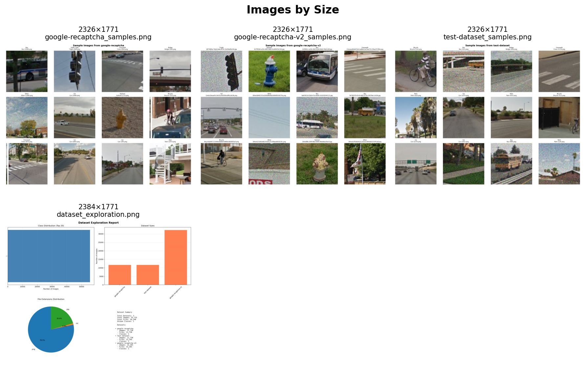
*(이미지 크기 분포)*

- **문제점**: 데이터셋의 이미지가 100x100과 120x120 두 가지 크기로 혼재되어 있었습니다.
- **해결책**: 112x112로 리사이징을 수행하였습니다.
- **이유**: 전체 평균인 107.4px에 근접하며, HOG 특징 추출 시 8x8 셀이 14개로 나누어지는 크기이기 때문입니다.

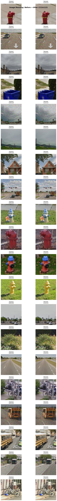
*(리사이징 전후 비교 - 이미지 규격 통일)*

### 1-2. 다양한 전처리 기법 실험
이미지 품질과 특징 추출 효율을 높이기 위해 여러 기법을 비교하였습니다.

#### A. 노이즈 제거 (Noise Reduction)
Gaussian Blur와 Bilateral Filter의 노이즈 제거 효과를 비교하였습니다.

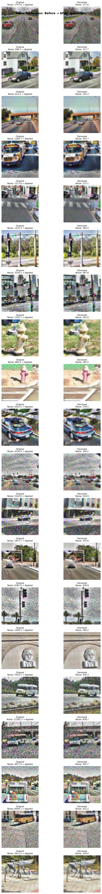

- **결과**: Bilateral Filter가 엣지 보존에 유리하나 연산 비용이 Gaussian Blur 보다 높고, 112px 크기에서는 큰 차이가 없어 Gaussian Blur를 채택하였습니다.

#### B. 대비 향상 (CLAHE)
어두운 이미지의 객체 인식을 돕기 위해 CLAHE를 적용하였습니다.

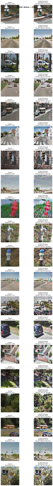
*(좌: 원본, 우: CLAHE 적용 - 객체 윤곽 개선)*

#### C. 색공간 변환 (Color Space)
특징 분석에 유용한 색공간을 확인하였습니다.

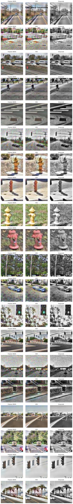
*(YCrCb, HSV 등으로 변환하여 특징 분석)*

---

## Part 2. 머신러닝 분석 (Traditional ML)

이미지에서 특징을 추출하여 머신러닝 모델을 학습시키고 분석하였습니다.

### 2-1. 특징 추출 및 분석 (Feature Engineering)
HOG(형태), Color Histogram(색상), LBP(질감) 등 다양한 특징을 추출하였습니다.

**특징 분포 및 상관관계 분석:**
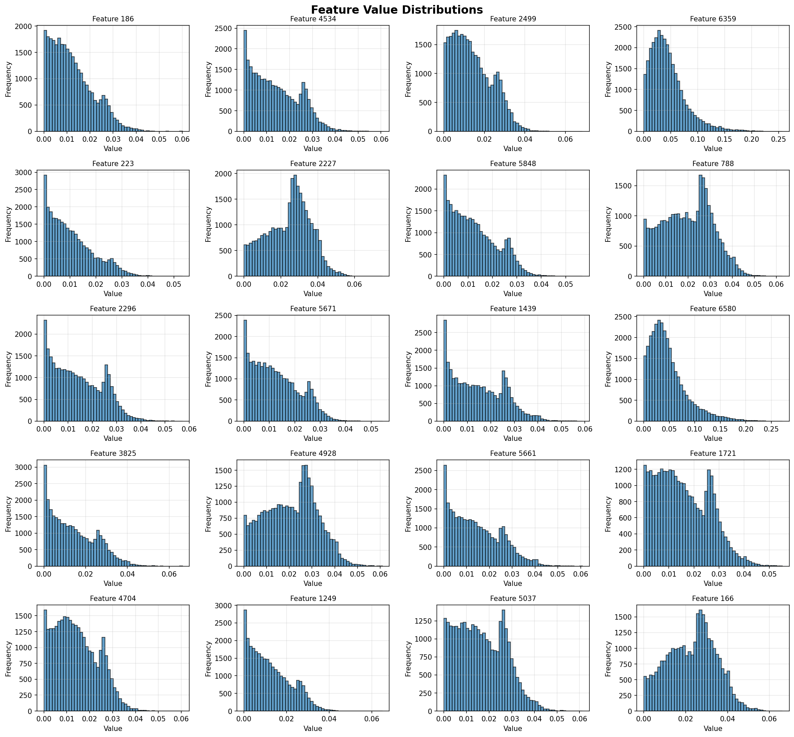
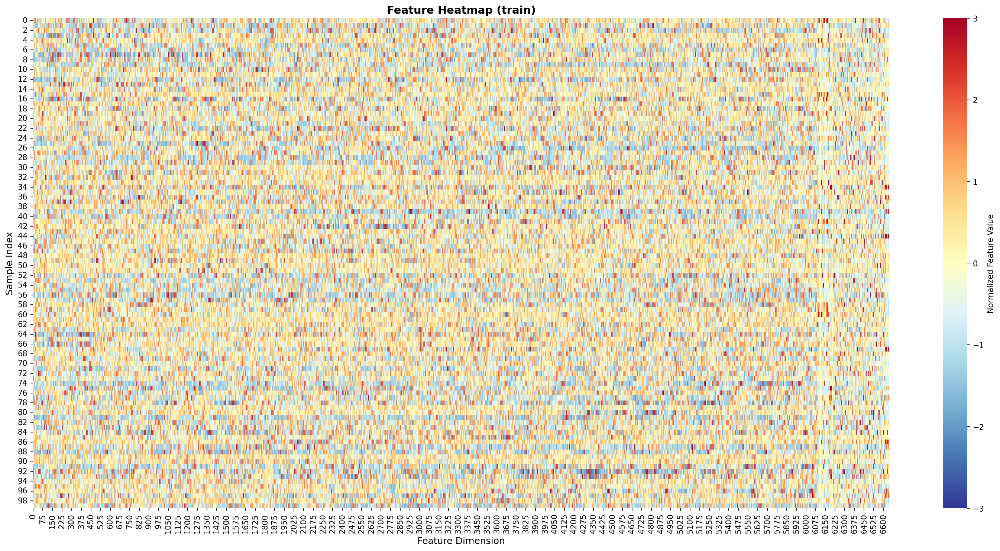

- 특징 간 상관관계 분석 결과 복잡한 구조임을 확인하였습니다.

### 2-2. 차원 축소 및 설명력 (PCA Analysis)
PCA를 수행하여 특징의 중요도를 분석하였습니다.

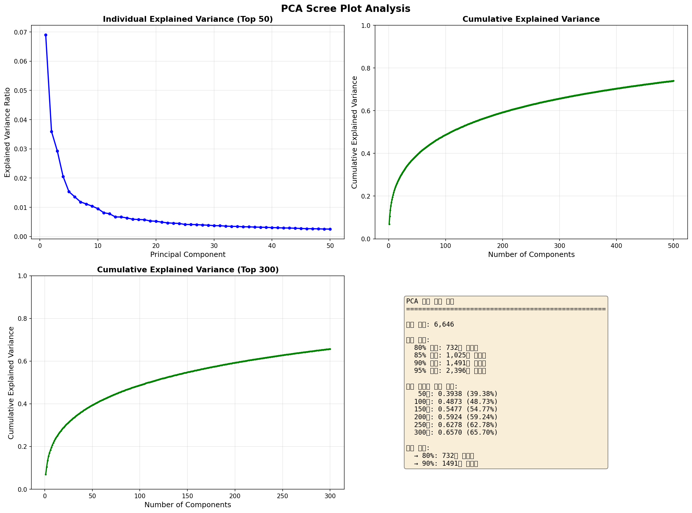
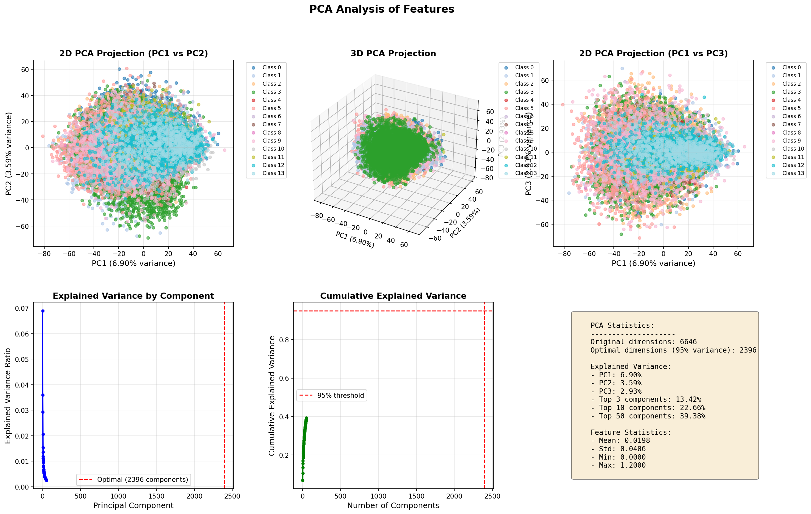

- **결과**: 제1주성분(PC1)의 설명 분산이 6.9%로 낮게 나타났습니다.
- **해석**: 수동으로 정의한 특징들이 데이터의 복잡성을 충분히 설명하지 못함을 의미합니다.

### 2-3. Random Forest 학습 결과
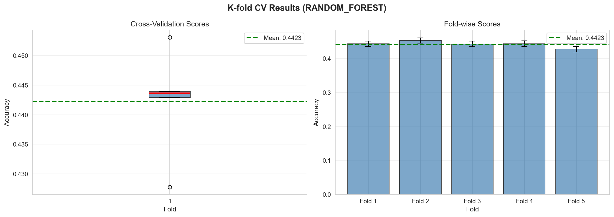
- **한계**: Cross-Validation 정확도가 70% 중반에서 정체되어 딥러닝 방식 도입을 결정하였습니다.

---

## Part 3. 딥러닝(CNN) 도입 및 개선 (Deep Learning)

EfficientNet 기반의 CNN 모델을 도입하고 성능을 최적화하였습니다.

### 3-1. 초기 연구 (Initial Research)
초기에는 전처리(Blur+CLAHE)된 이미지를 학습에 사용하였습니다.

**Confusion Matrix (초기):**
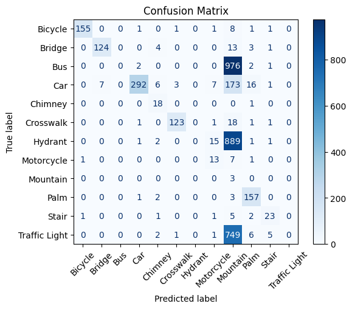
- 버스/트럭, 다리/도로 간 혼동이 발생하였습니다.
- **원인**: 과도한 전처리(Over-smoothing)로 인해 CNN 학습에 필요한 세부 특징이 손실되었습니다.

**Learning Curve (초기):**
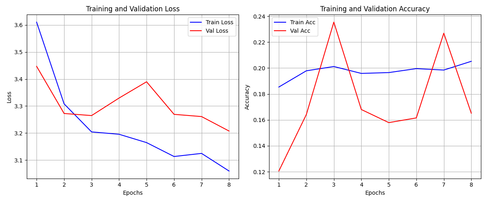
- 손실 값의 변동이 크고 정확도 향상이 정체되었습니다.

### 3-2. 데이터 중심 개선 (Data-Centric AI)
데이터 품질 개선에 집중하여 성능을 향상시켰습니다.

1.  **데이터 정제**: MD5 해싱을 통해 중복 이미지를 제거하여 데이터 누수를 방지하였습니다.
2.  **라벨 정리**: 중복되는 라벨('TLight', 'Traffic Light')을 통합하였습니다.
3.  **불균형 해소 (Weighted Sampling)**:
    - **문제**: 클래스 간 데이터 수 차이로 인한 학습 불균형 발생.
    - **해결**: `WeightedRandomSampler`를 도입하여 모든 클래스가 학습 과정에서 고르게 노출되도록 하였습니다.

### 3-3. 데이터 증강 (Augmentation)
모델의 일반화 성능을 높이기 위해 데이터 증강을 적용하였습니다.

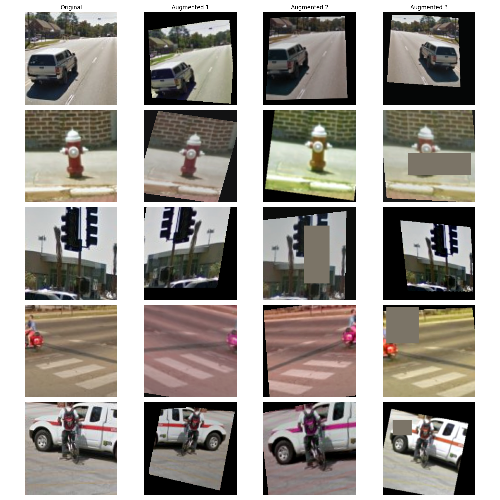
*(Cutout, 왜곡 등을 적용한 이미지 증강)*

---

## Part 4. 최종 결과 (Final Results)

데이터 중심 개선을 통해 고도화된 V3 모델의 최종 성능입니다.

### 4-1. 학습 결과 (Training Results)
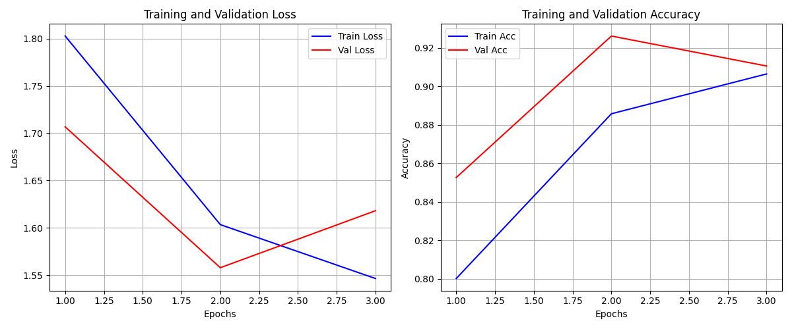
- **Accuracy**: 98.75% 달성
- **Loss**: 안정적 수렴 확인

### 4-2. 최종 오차 행렬 (Confusion Matrix)
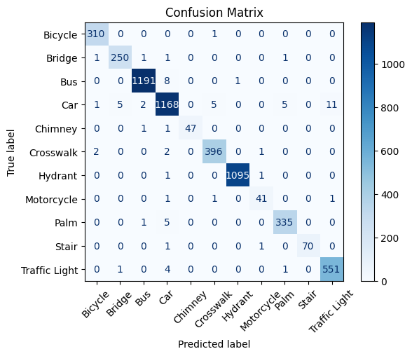
- 거의 모든 클래스에서 정확한 분류가 이루어졌으며, 이전의 혼동 사례가 해결되었습니다.

### 4-3. 모델의 판단 근거 확인 (Grad-CAM Analysis)
Grad-CAM을 사용하여 모델이 객체의 특징을 올바르게 인지하는지 검증하였습니다.

**Case 1: 자동차 (Car)**
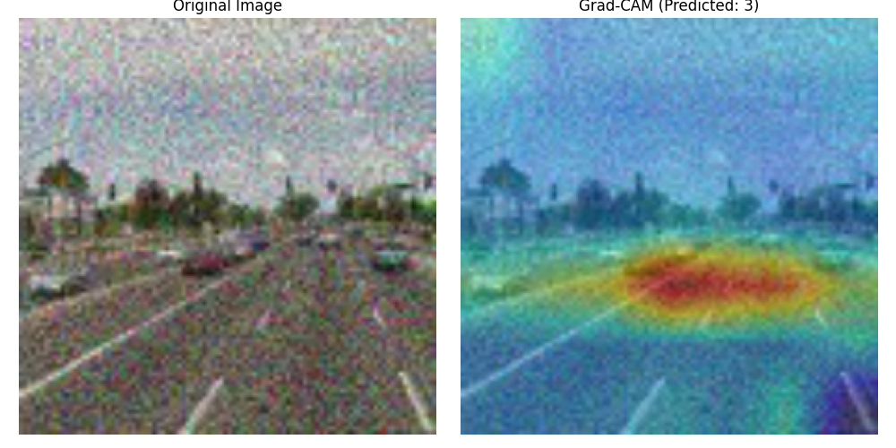
*(자동차의 바퀴 및 윤곽 인지)*

**Case 2: 횡단보도 (Crosswalk)**
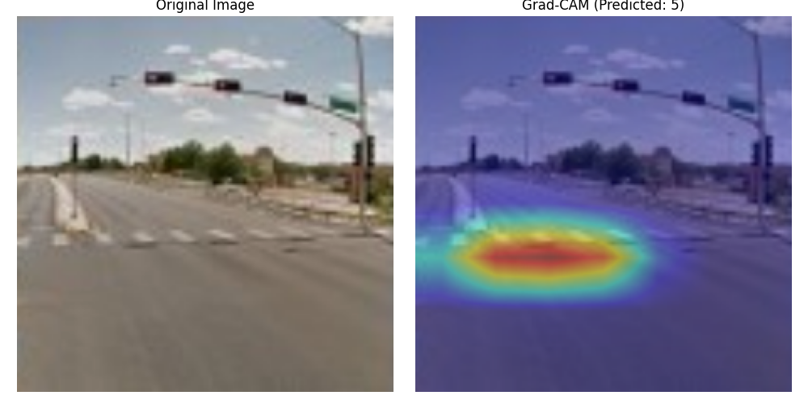
*(패턴 특징 인지)*

**Case 3: 야자수 (Palm)**
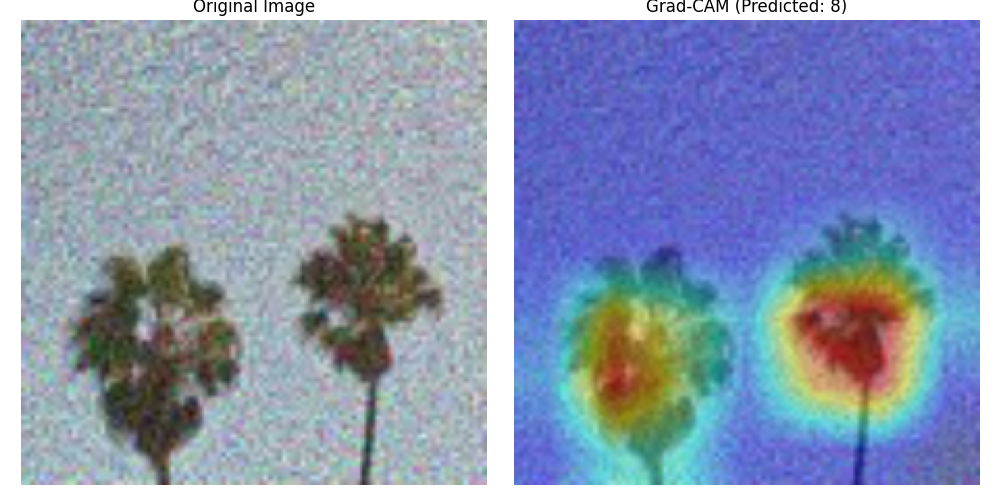
*(잎의 질감 인지)*

---

## 결론 (Conclusion)

1. **전처리 영향**: 머신러닝과 달리 딥러닝에서는 과도한 전처리가 학습을 저해할 수 있음을 확인하였습니다.
2. **데이터 품질**: 중복 제거 및 불균형 해소가 모델 구조 변경보다 성능 향상에 효과적이었습니다.
3. **설명 가능성**: Grad-CAM을 통해 모델의 판단 근거를 시각적으로 검증하여 신뢰성을 확보하였습니다.
